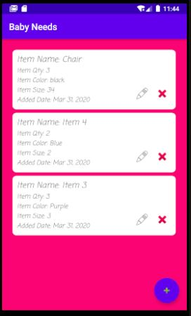
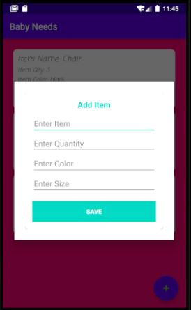
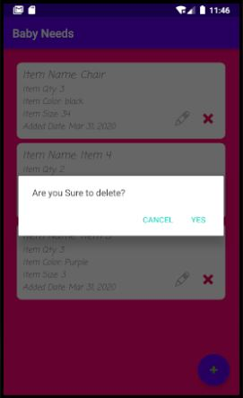

# BabyNeeds
## Introduction
 Its a Baby Needs App using SQLiteOpenHelper class.  
##   <u>Following concepts and technologies are used in the application :<u> 
<ol>
<li> <b>SQLiteOpenHelper </b>– to save data.
<li> <b>RecyclerView </b>– to load data from firebase in a list.
<li> <b>AlertDialog </b>–to show alerts of add item, uopdate item and delete item.
<li> <b>FloatinActionButton</b>– button to add items.
</ol>

    
    
    

If you have any queries or suggestions you can mail me: f158185@nu.edu.pk

You are welcome to suggest any changes, just send a pull request.
